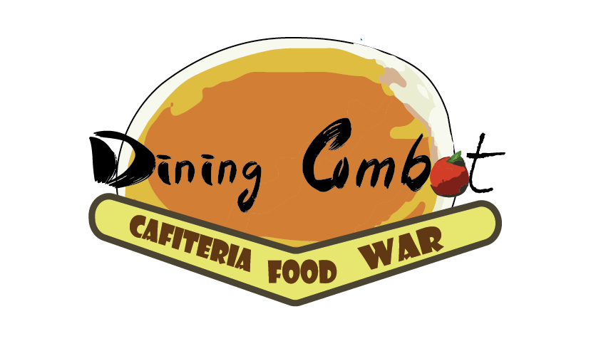

# DiningCombat

## Description

**Description: DiningCombat- A Fast-Paced 3D Battle Royale Game**

In Dining Combat, we embark on a daring mission to challenge the gaming world and introduce a fresh and exhilarating niche. Inspired by the concept of chaos, which thrives in the real world, finds great success in film and television, and even has its own branch in mathematics, our game offers an action-packed experience like no other.

Engaging players in a fast-paced 3D Battle Royale environment, Dining Combat dares them to abandon conventional long-term strategies and embrace the thrill of constant action. In this chaotic playground, players can't afford to see the big picture, but instead, they must stay on their toes, reacting swiftly to unpredictable challenges and relentless competition.

All weapons in Dining Combat are "disposable," encouraging players to seize every opportunity to outsmart opponents and secure a chance at survival. Roaming the world for randomly scattered food, players unleash their inner mischievousness, launching food attacks to hit as many opponents as possible. But beware, the environment itself is an ally to chaos, throwing obstacles and challenges that try to diminish your life in unexpected ways.

The game's lighthearted approach ensures that players of all ages can partake in the excitement, as "Dining Combat" is designed to be kid-friendly, free from bloodshed or death. With its unique blend of action, Battle Royale elements, and the essence of chaos, the game promises a rollercoaster of laughter, thrill, and unforgettable moments.

Join the little boy's food war saga as it unfolds in the school cafeteria, where a simple food fight escalates into a chaotic showdown. Each player vies to be the last one standing, proving their mettle in the ultimate test of skill, strategy, and luck.

Are you ready to embrace the chaos and outwit your rivals? Get ready for Dining Combat - a captivating journey into the heart of exhilarating mayhem, where every bite could be your last!

## Screenshots

Include some appealing screenshots or GIFs showcasing the gameplay or different aspects of your game. Images can be a powerful tool to attract users and give them a glimpse of what they can expect.

## Installation

To enjoy the chaotic fun of "Food War Chaos," follow these simple steps to install and play the game on your system:

System Requirements:

OS: Windows 7/8/10 (64-bit)
Processor: Intel Core i5 or equivalent
Memory: 8 GB RAM
Graphics: NVIDIA GeForce GTX 660 or equivalent
DirectX: Version 11
Storage: At least 2 GB available space

## How to Play

Explain how to play the game, including controls and objectives. Make it clear and easy to follow, so users can quickly jump into the game and start enjoying it.

Credits
We extend our heartfelt gratitude to the following individuals who made significant contributions to the development and success of DiningCombat:

Aviv Kaufman and Berry Ackerman - The talented animators whose excellent work brought life to the game's characters and animations. Their dedication and support as team members were invaluable.

Amit Ben Best - For providing us with invaluable guidance and mentorship throughout the project, helping us navigate challenges and refine our vision.

Ella Luna - A special thanks for her technical expertise, unwavering support, and guidance, which played a crucial role in shaping the game's mechanics and experience.

Amit Beshari - We are grateful for his generous help and for sharing his vast knowledge in game design, which enriched the creative process.

Chai BaSapir - For fostering a supportive and nurturing environment that allowed us to flourish during the development of "Food War Chaos."

Jacob Zak - Thanks to his dedicated efforts and expertise in development, the game reached new heights and achieved its full potential.

We also extend our appreciation to all team members, collaborators, and external resources who contributed their time and skills to bring DiningCombat to life.

Your contributions have been instrumental in creating a game that brings joy and excitement to players of all ages. Thank you for being a part of this amazing journey!

## Contact

[Game page on itch.io](https://diningcombat.itch.io/dining-combat)
[Project page](https://eviatarduany.wixsite.com/diningcombat)

## License

The Dining Combat game is proprietary software provided under the following license agreement:

**End User License Agreement (EULA)**

1. You ("the User") are granted a non-exclusive and non-transferable right to play and use the Dining Combat game solely for personal and entertainment purposes.

2. The User is not allowed to modify, distribute, sell, lease, sublicense, or create derivative works based on the Dining Combat game.

3. The User agrees not to reverse engineer, decompile, disassemble, or attempt to discover the source code of the Dining Combat game.

4. The intellectual property rights, including copyrights and trademarks, associated with the Dining Combat game, are and shall remain the exclusive property of evduanG.

5. evduanG reserves the right to update, modify, or discontinue the Dining Combat game at any time without prior notice.

6. The Dining Combat game is provided "as is," and evduanG makes no warranties or guarantees regarding its functionality, performance, or suitability for any purpose.

7. The User agrees to use the Dining Combat game in compliance with all applicable laws and regulations.

8. This license agreement is effective upon the User's acceptance of the terms and shall remain in effect unless terminated by evduanG. Upon termination, the User must cease all use of the Dining Combat game.

By playing and using the Dining Combat game, you (the User) agree to be bound by the terms and conditions of this End User License Agreement.

For any questions or concerns regarding the license or use of the Dining Combat game, please contact evduanG at [linkdin](https://www.linkedin.com/in/eviatar-duany/)

### Version 1.0.0 - Date
